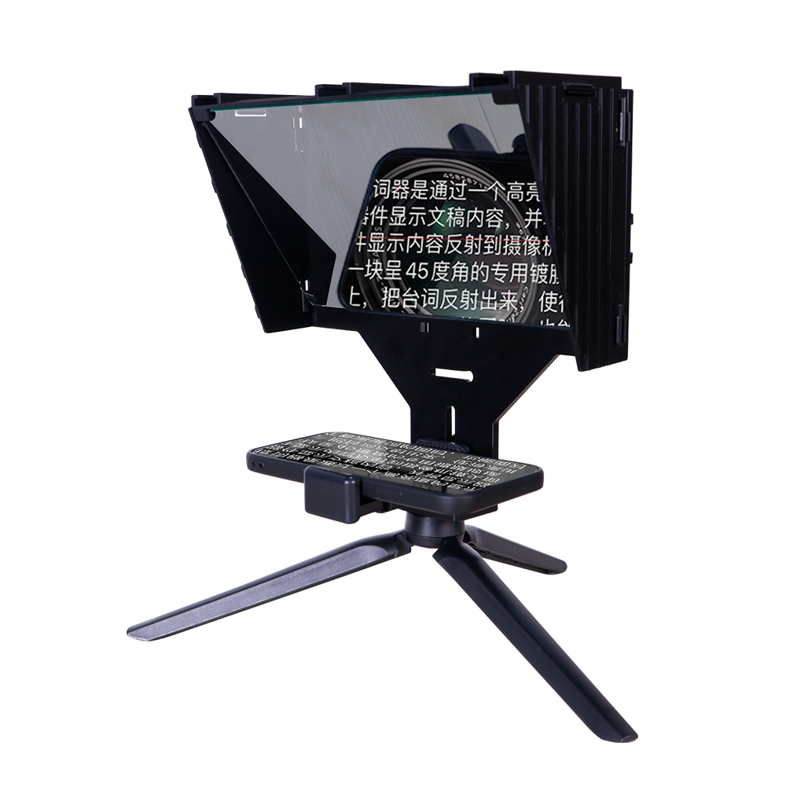
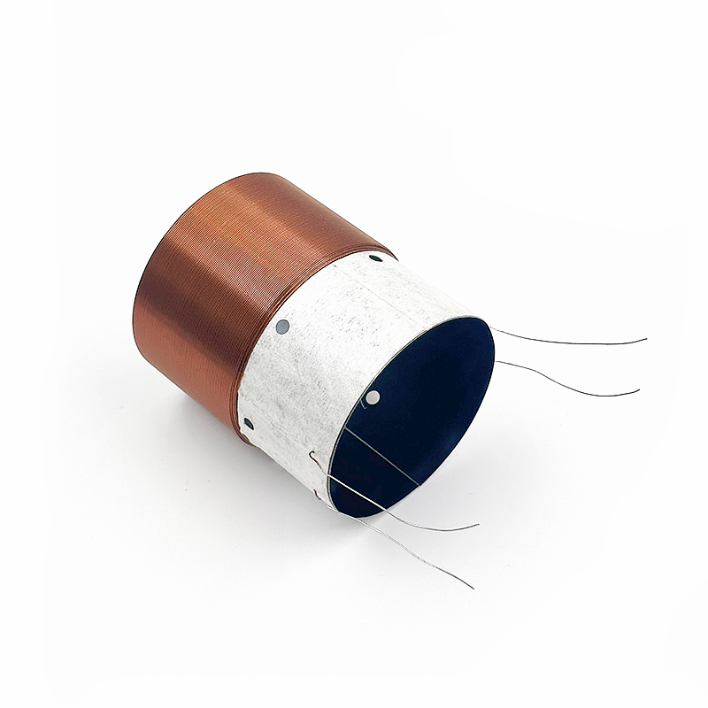
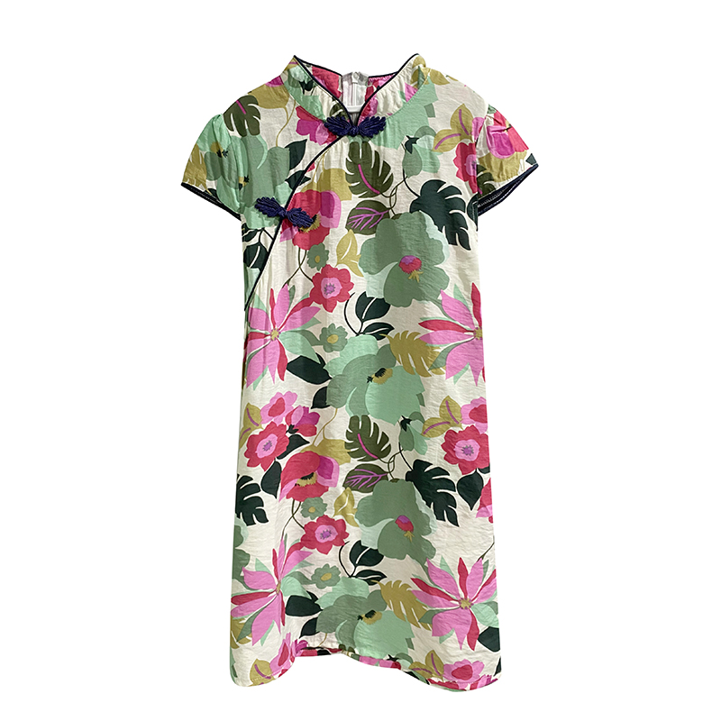
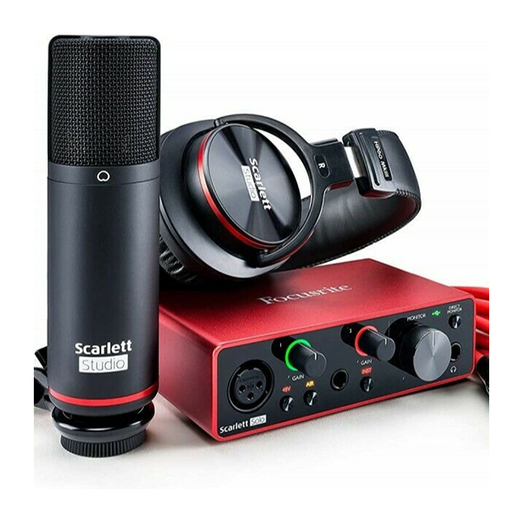
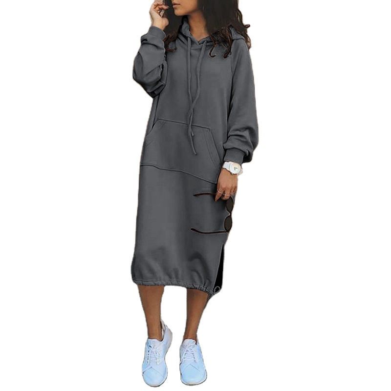
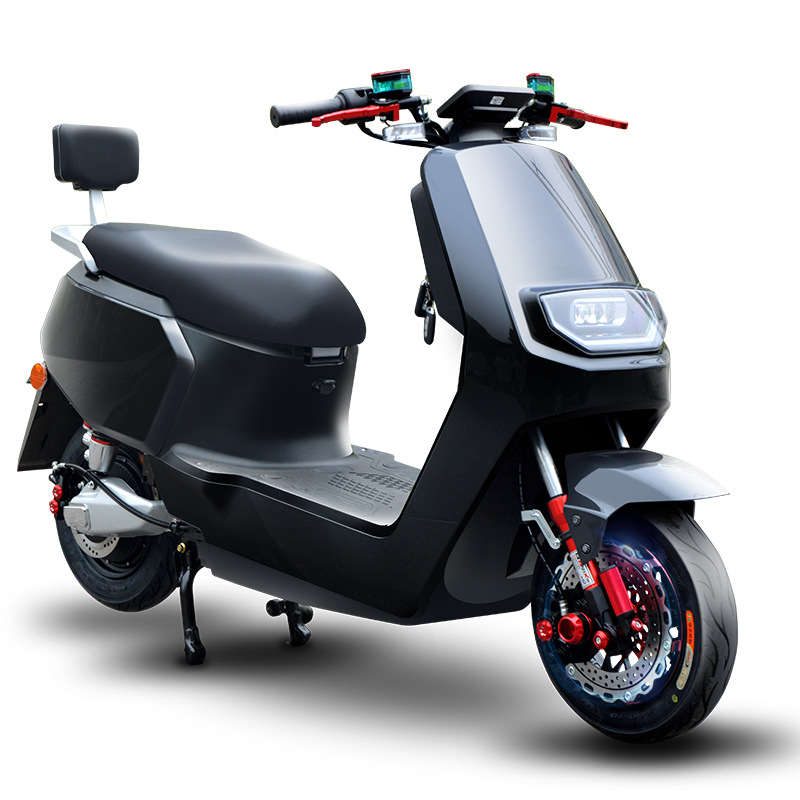
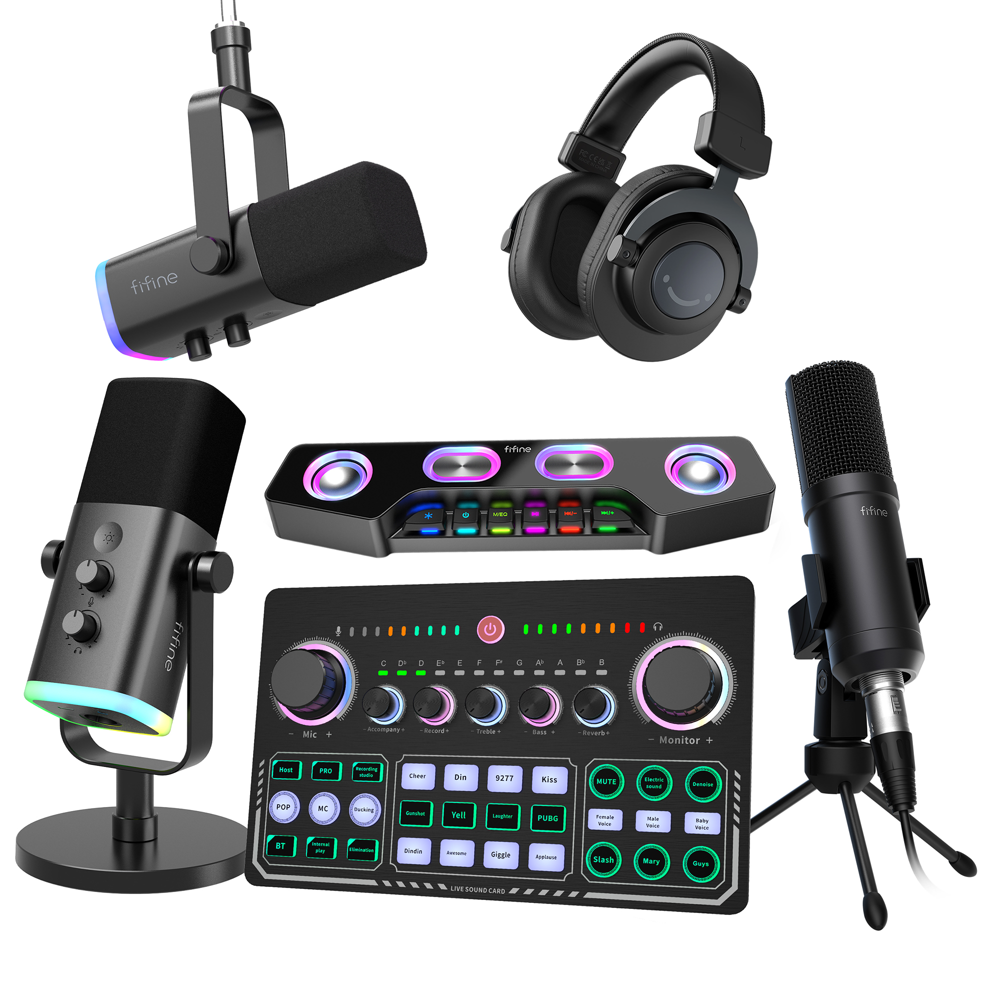
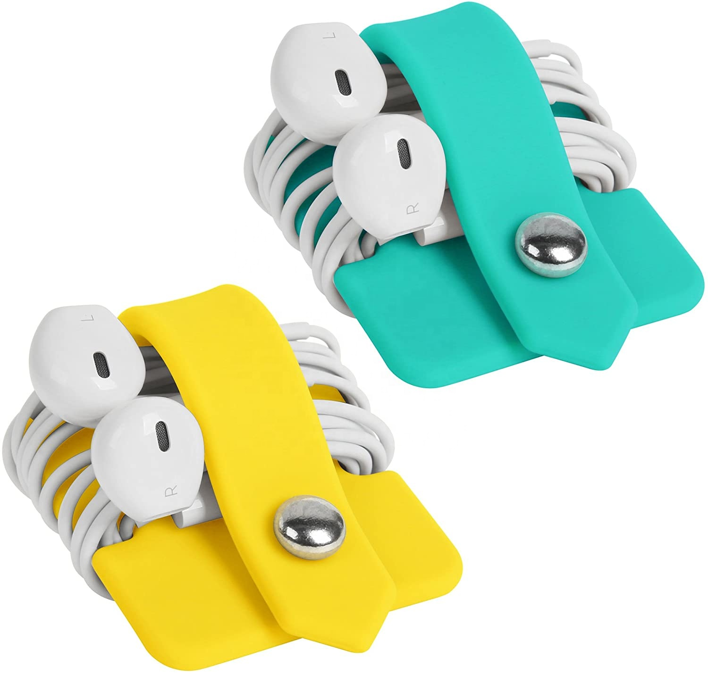

<p align="center">
  
</p>

<h1 align="center">SmartQ E-Commerce Platform</h1>

<p align="center">
  <strong>Alibaba-Style Multi-Vendor E-Commerce Platform with B2B & B2C Features</strong>
</p>

<p align="center">
  
  
  
  
</p>

<p align="center">
  
</p>

---

## [i] Features



### [Shop] Shop Features
- **[List]** Alibaba-Style Mega Menu - Hierarchical categories with real images
- **[Bolt]** Super Deals Carousel - Auto-rotating deals with countdown timers
- **[Search]** Advanced Product Search - Multi-category filtering
- **[Cart]** Shopping Cart - Session-based cart with AJAX updates
- **[Check]** Checkout System - Complete order management
- **[Mobile]** Mobile Responsive - Fully optimized for all devices

### [Lock] Admin Panel
- **[Users]** Role-Based Access Control - Superadmin, Admin, Seller, Manufacturer roles
- **[Chart]** Dashboard Analytics - Sales charts and statistics
- **[Box]** Product Management - CRUD operations with image uploads
- **[Cog]** User Management - Complete user administration
- **[List]** Order Management - Track and manage all orders
- **[Wrench]** Site Settings - Dynamic configuration

### [Building] B2B Features
- **[Industry]** Manufacturer Profiles - Verified supplier listings
- **[File]** Tax Exemption System - B2B tax management
- **[Boxes]** Bulk Ordering - Wholesale pricing support
- **[Shield]** Order Protection - Secure transaction system

### [User] User Features
- **[IdCard]** Multi-Role System - Buyer, Seller, Manufacturer
- **[Tachometer]** Dashboard per Role - Custom dashboards for each user type
- **[UserCog]** Profile Management - Complete user profiles
- **[History]** Order History - Track all purchases

---

## [Rocket] Quick Start


### Prerequisites
- PHP >= 8.0
- Composer
- MySQL/MariaDB
- Node.js & NPM

### Installation

```bash
# Clone repository
git clone https://github.com/yourusername/smartq.git
cd smartq

# Install dependencies
composer install
npm install

# Configure environment
cp .env.example .env
php artisan key:generate

# Setup database (edit .env first)
php artisan migrate --seed

# Compile assets
npm run dev

# Start server
php artisan serve
```

### Access URLs
| URL | Description |
|-----|-------------|
| `http://localhost:8000/` | Landing Page |
| `http://localhost:8000/shop` | Shop |
| `http://localhost:8000/admin` | Admin Panel |
| `http://localhost:8000/login` | Login |

---

## [Users] Default Accounts

<p align="center">
  
</p>

| Role | Email | Password |
|------|-------|----------|
| Super Admin | superadmin@smartq.com | password |
| Admin | admin@smartq.com | password |
| Seller | seller@smartq.com | password |
| Manufacturer | manufacturer@smartq.com | password |
| Buyer | buyer@smartq.com | password |

---

## [Folder] Project Structure

```
smartq/
├── app/
│   ├── Http/Controllers/     # Controllers
│   │   ├── AdminController.php
│   │   ├── ShopController.php
│   │   └── ...
│   ├── Models/               # Eloquent Models
│   │   ├── User.php
│   │   ├── Product.php
│   │   ├── Category.php
│   │   └── ...
│   └── ...
├── database/
│   ├── migrations/           # Database migrations
│   └── seeders/              # Database seeders
├── resources/
│   └── views/                # Blade templates
│       ├── admin/            # Admin panel views
│       ├── shop/             # Shop views
│       └── ...
├── public/                   # Public assets
│   ├── images/               # Uploaded images
│   ├── 34337.jpg             # Hero image
│   └── index.php             # Entry point
├── routes/
│   └── web.php               # Web routes
└── ...
```

---

## [Database] Database Seeders

<p align="center">
  
  
  
</p>

- **RoleSeeder** - Default roles and permissions
- **CategoryMegaMenuSeeder** - Hierarchical categories with 50+ subcategories
- **ProductRealImagesSeeder** - 38 products with real images
- **DatabaseSeeder** - All sample data

Run seeders:
```bash
php artisan db:seed
```

---

## [Shield] Security Features


- CSRF Protection - All forms protected
- Role-Based Middleware - Route protection
- Password Hashing - Bcrypt encryption
- SQL Injection Prevention - Parameterized queries
- XSS Protection - Blade escaping

---

## [Mobile] Responsive Design

Fully responsive across all devices:

<p align="center">
  
  
  
</p>

- **[Desktop]** Desktop - Full mega menu, grid layouts
- **[Tablet]** Tablet - Optimized grid, touch-friendly
- **[Mobile]** Mobile - Collapsible menu, stacked layouts

---

## [FileCode] Key Pages

### Landing Page
<p align="center">
  
</p>

- Hero slider with promotional content
- Service showcase
- Featured categories
- Testimonials
- FAQ section
- Contact information

### Shop
<p align="center">
  
</p>

- Product grid with filters
- Category mega menu
- Super deals section
- Product details
- Shopping cart
- Checkout process

### Admin Panel
<p align="center">
  
</p>

- Dashboard with charts
- User management
- Product management
- Order management
- Settings configuration

---

## [Cog] Configuration

### Environment Variables
Key configurations in `.env`:

```env
APP_NAME=SmartQ
APP_ENV=local
APP_DEBUG=true

DB_CONNECTION=mysql
DB_HOST=127.0.0.1
DB_PORT=3306
DB_DATABASE=smartq
DB_USERNAME=root
DB_PASSWORD=

MAIL_MAILER=smtp
MAIL_HOST=smtp.mailtrap.io
MAIL_PORT=2525
```

---

## [Rocket] Future Enhancements

- [ ] Payment gateway integration (Stripe, PayPal)
- [ ] Real-time notifications
- [ ] Chat system between buyers and sellers
- [ ] API for mobile apps
- [ ] Multi-language support
- [ ] Advanced analytics dashboard

---

## [Handshake] Contributing

1. Fork the repository
2. Create your feature branch (`git checkout -b feature/amazing-feature`)
3. Commit your changes (`git commit -m 'Add some amazing feature'`)
4. Push to the branch (`git push origin feature/amazing-feature`)
5. Open a Pull Request

---

## [File] License

MIT License - see [LICENSE](LICENSE) file.

---

<p align="center">
  
</p>

<h3 align="center">SmartQ Development Team</h3>

<p align="center">
  <strong>Website:</strong> <a href="https://www.smartq.co.tz">www.smartq.co.tz</a><br>
  <strong>Email:</strong> info@smartq.co.tz<br>
  <strong>Location:</strong> Dar es Salaam, Tanzania
</p>

---

<p align="center">
  <strong>Made with [Heart] in Tanzania</strong>
</p>

<p align="center">
  <em>SmartQ - Your Ultimate B2B & B2C E-Commerce Solution</em>
</p>
